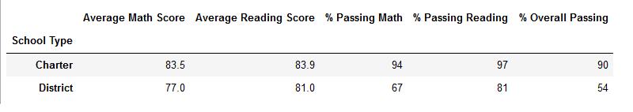

# School_District_Analysis

## Overview
The purpose of this analysis is to provide the school board with key data metrics on the performance of the district. This will help them make well informed decisions about the future of the district and each of the schools. There was a case of academic dishonesty resulting in Thomas High Schools 9th Grade scores being dropped. The two results will be compared side-by-side as result and result adjusted.

## Results
### District Summary
District Summary:

Adjusted District Summary:

### School Summary
District Summary:

Adjusted School Summary:

### Additional Metrics

Scores by Spending:

Adjusted Scores by Spending:

Scores by Size:

Adjusted Scores by Size:

Scores by School Type:

Adjusted Scores by School Type:

## Summary

Overall, the removal of the Thomas High School's 9th Grade scores did not change much of anything. The specifics for each metric are as follows:
- District Summary: Average math score decreased slightly, % Passing decreased for all categories
- School Summary: Thomas High School's scores and passing rates decreased slightly across the board, though their relative standing compared to the other schools did not change
- Scores by Spending: No noticeable change
- Scores by School Size: No noticeable change
- Scores by School Type: No noticeable change
